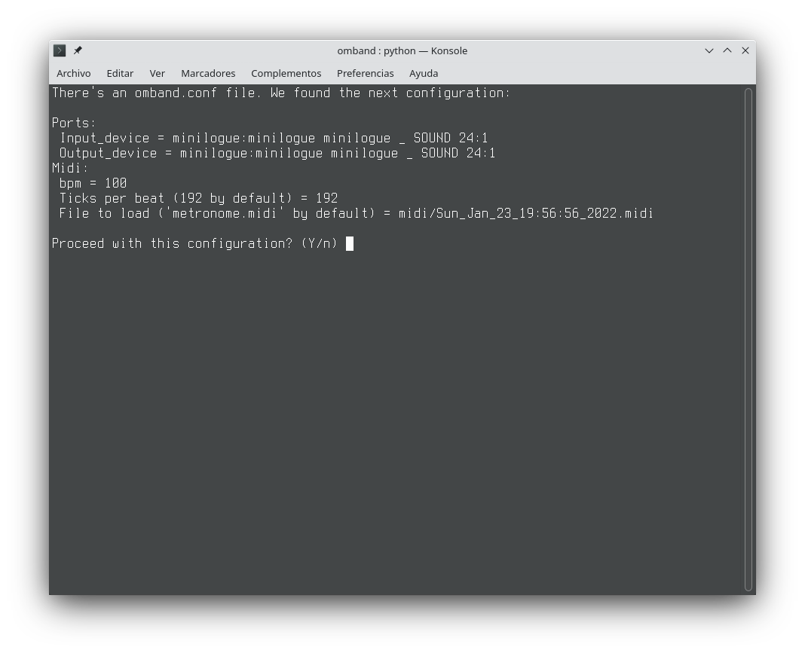
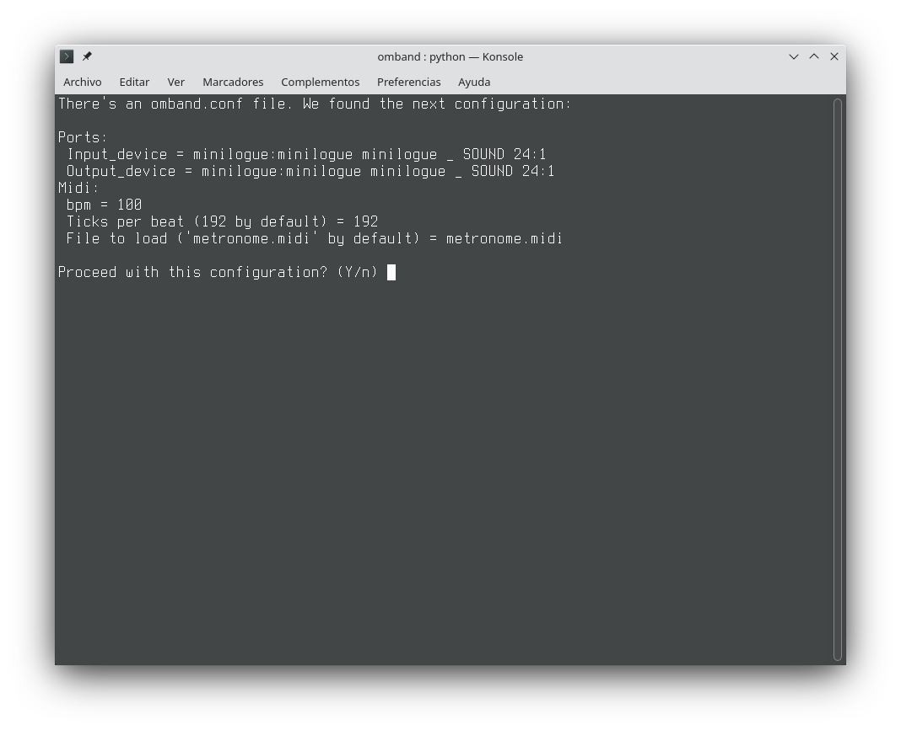
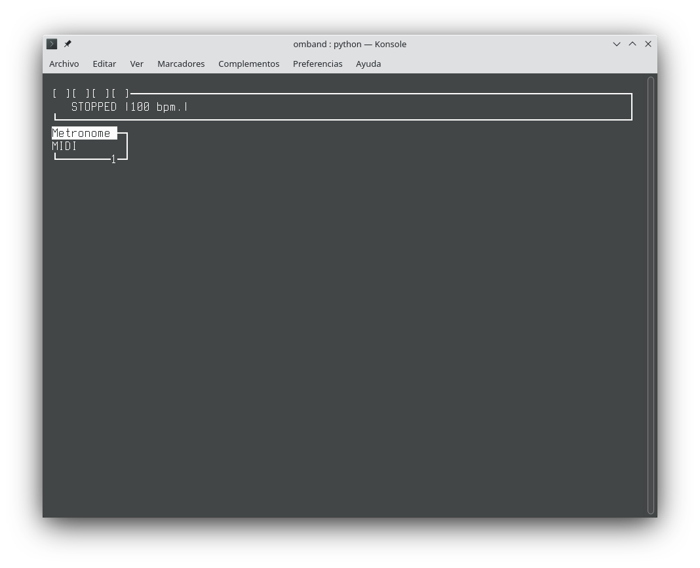
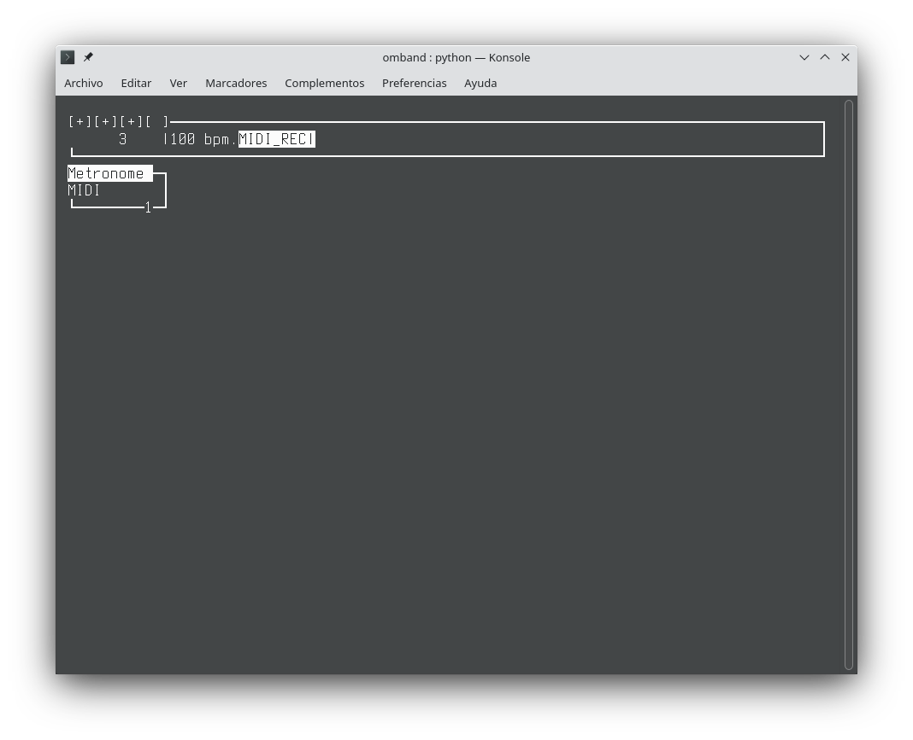
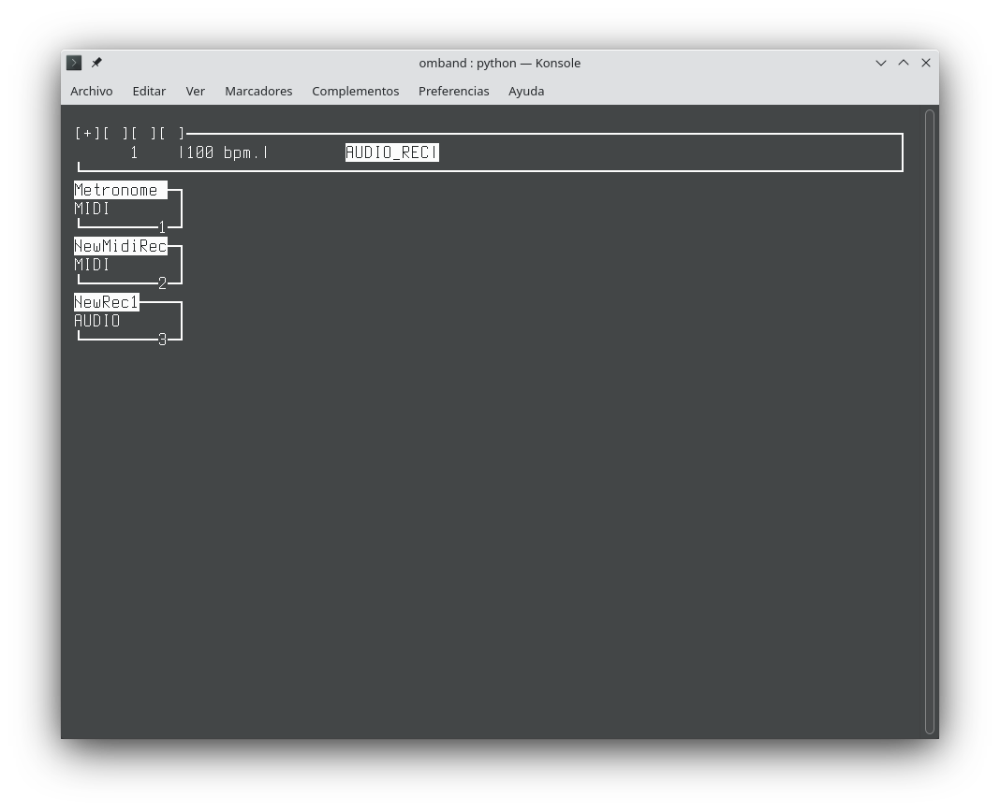

# Screenshots

# What is it?

Have you ever seen some person playing a guitar with a looper pedal on the street? That's what this program is for, but with two fundamental differences:
1. Although it can be used with any source of audio, this is intended for using a synthesizer.
2. It has midi integrated, as well as audio, so it can be used as both an audio looper and a midi looper, all at once. You can "bounce" your midi tracks as audio recording a new track as audio.

So, we could say this software is a WIP CLI midi and audio looper. You can record and play midi and audio, all in sync, so with a hardware synthesizer and a line input in your audio interface you are able to record many tracks which will loop. It is possible, as well, to mute/deactivate tracks and activate them again without stopping. They will activate or deactivate when the loop ends, not immediately.

This could be considered a beta. It works, but some bugs are expected. Don't use it live, as it could fail, and I would be really sad if someone faced humilliation because of my mistakes.

# What can I do with omband?

- Record midi loops from an external synthesizer or midi controller.
- Record midi loops with different lengths in a 4/4 rythm.
- Easily bounce those midi loops to audio (pressing a button), as long as the input audio in your computer is set to the audio output of your synthesizer.
- Change the config file (omband.conf) in order to adapt omband to your needs:
    - Choose bpm.
    - Choose PPQN (called "ticks per beat" in omband).
    - Choose any midi file to load.
    - Choose your input and output ports of your synthesizer (in mine, it's the same port, for some reason).

# What isn't working or needs improvement?

THIS HAS BEEN TESTED ON LINUX ONLY.

- Curses in python crashes when shrinking too much the console window. I'm not sure how to fix it, and if it's possible at all.
- When you quit, the console is messed up and it needs to be closed, I would love to know what is causing it and fix it.
- It needs a midi file in order to load, but I don't want that. It will load any midi file indicated in omband.conf, though. By default, it loads a midi file with a metronome track (easily muted if you don't need it).
- Controls have to improve. They are still hardcoded as well.
- Check why the names of the ports in my synth are the same. I had to choose a few ports of my synth until it worked. Is it a problem with linux or a problem with omband?
- Documentation.
- Refactorization and renaming.

# Dependencies

- curses (it should be included in Linux, maybe not in Windows)
- mido
- python-rtmidi
- pyaudio (ATTENTION: pyaudio fails in python 3.10. There's a fork of pyaudio which solves this error (related to PY_SSIZE_T_CLEAN) until pyaudio is updated)
- pygame (I want to get rid of this dependency, though)

# How to use?

## Play/Stop

If you press "p" on your keyboard, it will start playing or stop playing.

## Audio recording

If you press "a" on your keyboard, it will arm a new track to record audio. If it's stopped, it will start recording as soon as you press "p" to play. If it's playing, it will start recording as soon as a new bar is started.

## Midi recording

If you press "r" on your keyboard, it will arm a new track to record midi. If it's stopped, it will start recording as soon as you press "p" to play. If it's playing, it will start recording as soon as a new bar is started.

## Delete last audio track

You can delete the last audio track pressing "d". It will not delete midi tracks, though.

## Deactivate midi track

If you press the same number as the index of the midi track, it will start/stop playing as soon as that particular loop ends. For example, if you want to deactivate midi track number 3, you just press "3" on your keyboard.

## Save midi file

Your audio tracks will be overwritten by a new program, but you could save new versions of your midi tracks when pressing "g" at any moment. It will not have any feedback, but a directory will be created alongside the program with a new midi file whose name will be the current date and time. It will not overwrite previous versions.
The midi file will be a type 1 midi file. That means "multitrack" midi file, so you could open it with other programs, like Sequencer64, and it will work.

## Quit

Press "q" and omband will stop and you will be in a messed up console. At least the program would have finished.
If someone knows how to fix this bug, please, be kind to tell me how.
